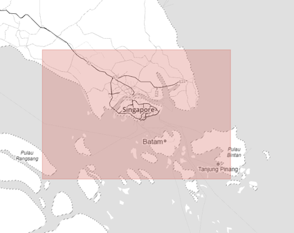
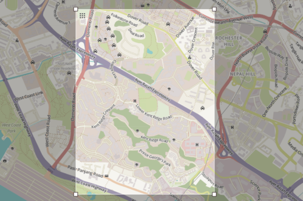
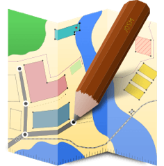

## Python Data Wrangling Project with SQL- Investigating Singapore OpenStreetMap
Data munging skills are some of the most important for career of data engineers, as data engineers always need to wrangle data before using them for any analysis. For this project, I choosed `Singapore` map from https://www.openstreetmap.org as the case of study, as I am very interested to see the unseen part of the little red doton pacific ocean that I am both familiar with and alien to, by the data mining skills I have learned. This is quite a time-consuming and exhausting project, but I learned a lot useful handy data munging techniques from it, such as assessing the quality of the data for validity, accuracy, completeness, consistency and uniformity, to clean the OpenStreetMap data. Finally, I used SQL as the data schema to wrap up the data investigation part.  

If you are interested in it, please check **`P3_OSM_case_study.pdf`** for detailed documentation! 

## Skills Used
- Parse and gather data from popular file formats such as .csv, .json, .xml, and .html
- Process data from multiple files or very large files that can be cleaned programmatically.
- Store, query, and aggregate data using SQL.

More Specificly, they are:

Skills | Tasks
--- | ---
DATA EXTRACTION | Assess the quality of a dataset and parse CSV files and XLS with XLRD; Use JSON and Web APIs
DATA IN COMPLEX FORMATS |  Parse XML & HTML under the guide of XML design principles;Scrape websites for relevant data
DATA QUALITY | Identify common sources for dirty data; Measure the quality of a dataset & apply a blueprint for cleaning; Audit validity, accuracy, completeness, consistency;Understand common sources for dirty data
and uniformity of a dataset
SQL FOR DATA ANALYSIS | Run queries to summarize data by SQL;Use joins to combine information across tables;Handle external data
CASE STUDY: OPENSTREETMAP DATA|Iteratively parse large datafiles taking advantage of the structure of XML elements in OpenStreetMap

## Softwares and Libraries
- python 2.7
- RE
- XML
- SQL
- numpy
- pandas
- OverPass API.

**1. Map Area**

For this case study, I picked Sinagapore. First of all I live here for 2
years so I think of it immediately. Besides, even it is a tiny city
country ( actually its nickname is 'little red dot') , I am overwhelmed
by its complicated city planning and full-scale facilities. I am excited
to check out the awaiting suprising facts hidden in this OpenStreetMap
data!

NS（1.823,0.807）,EW(103.062,104.545)

<https://s3.amazonaws.com/metro-extracts.mapzen.com/singapore.osm.bz2>

**Malaysia**

**Indonesia**

**Singapore Area Extracts Map National University of Singapore Map**

For sampling, I picked NUS campus area (National University of
Singapore). Since I am very familiar with it.

NS（1.3094,1.2889）,EW(103.7702,103.7849)

<https://www.openstreetmap.org/exPort#map=15/1.2991/103.7775&layers=HN>

**2.Problems Encoutered**

First of all, to ease auditing and correcting, I converted raw sample
data into csv format using quiz file ***data.py***, during which I
realized the processing is very slow, considering the actual dataset of
interest is 65 as big as it, it is necessary to give progress report for
processing monitoring:

-   Process report

After importing the csv files into SQL, some short queries revealed
problems such as

-   inconsistent city names

-   invalid postcodes

Below I show part of the most representative result with regards to the
two problem:

***sqlite&gt;select value, count(\*) from nodes\_tags where key='city'
group by value order by count(\*) DESC ;***

*Singapore,1175*

*"Johor Bahru",60*

*Batam,35*

*"Ulu Tiram",9*

*Masai,6*

*Skudai,4*

*"Batam Kota",2*

… …

***sqlite&gt; select length(value),count(\*) from nodes\_tags where
key='postcode' and length(value) !=6 group by length(value);***

*3,1*

*4,3*

*5,619*

*7,2*

*8,1*

*16,1*

Situation for street names is bit complicated:

***sqlite&gt;select value from nodes\_tags where key='street' ;***

*"Gopeng St"*

*"67, Ubi road 1, Oxley Biz Hub 1, \#07-08"*

*Bukit Batok East Ave 5"*

*Tanjong Pagar Rd"*

*"Sin Min Ave"*

*"Libra Dr"*

… …

So I carried out an auditing on street name using ***audit.py***. After
runing it aginst ways\_tags.csv I noticed these following problems for
street names:

-   Abbreviations

-   Inappropriate postfix

-   Mixing house numbers

-   Inconsistent title case

**2.1 Progress Report**

My laptop is very slow in executing data.py even aginst the sample
dataset. To moniter the processing progress and secure control of work,
I add a progress report functionality to data.py before running it
against the whole 200 MB singapore map set, which takes me actually
hours to finish.

**2.2 Inconsistent City Names**

Though the dataset I downloaded from metro-extracts names ‘singapore’,
as we can see it actually is a rectanglar area which unavoidly involves
its neighbouring areas like Johor Baru (Malaysisa), Batam (Indonesia),
and so on. Therefore it’s more accurate to address this case study as
“OpenStreetMap Case Study of Singapore and Neighnoring Area”. Realizing
this, inconsistent city names are actually not problems. So just leave
it as it is.

**2.3 Invalid Postcodes**

Valid Singapore postal code should be 6 digits ,with 2~3 digits for
sector code and 3~4 digits for delivery point. I list these invalid
postcodes as below:

*5 digits: … … (Quite a lot. In total 619)*

*4 digits: 2424, 5901,2222*

*7 digits: S118556,S120517*

*16 digits: Singapore 408564*

*8 digits: S 278989*

*3 digits: 135*

The four cases,“S 278989”, “Singapore 408564”, “S118556”,”S120517”, are
valid singapore postcodes. We just need to do little manual work to
strip the prefix so that their format consistent: ***update nodes\_tags
set value="118556" where value="S118556"; … …***

After googling the neighboring area about their postcode format, I found
Malaysia and Indonesia share the 5 digit format of postcodes. Most of
the 619 5-digits must from the two country and thus should be valid. The
4 digits postcode, according to google, could be from Australia. But
even AU is geographically near to Singapore I am skeptical about the
possibility since I couldn’t find any suspect AU cities/islands within
the rectangular area above. To resolve this, I did a self.join query to
look at their related tags:

***sqlite&gt; select a.id,a.key,a.value,b.key,b.value ***

***…&gt;from nodes\_tags as a,nodes\_tags as b***

***…&gt;where a.id=b.id and a.value !=b.value and a.key='postcode' and
length(a.value) =4 order by a.id;***

*3026819436|postcode|2424|bitcoin|yes*

*3026819436|postcode|2424|city|Singapore*

*3026819436|postcode|2424|housenumber|136*

*3026819436|postcode|2424|landuse|retail*

*3026819436|postcode|2424|name|Liana Medic Ltd*

*3026819436|postcode|2424|phone|+65 2424666*

*3026819436|postcode|2424|street|Orchard Road*

*3026819436|postcode|2424|website|http://www.lianamedic.com/*

*3756813987|postcode|5901|amenity|restaurant*

*3756813987|postcode|5901|city|Singapore*

*3756813987|postcode|5901|country|SG*

*3756813987|postcode|5901|housenumber|6*

*3756813987|postcode|5901|name|Wonderful Food and Beverage*

*3756813987|postcode|5901|phone|+65 9108 5572*

*3756813987|postcode|5901|street|Sago Street*

*4445039991|postcode|2222|housenumber|2156*

*4445039991|postcode|2222|shop|travel\_agency*

*4445039991|postcode|2222|street|km 62*

Surprisingly, all of the three postcodes are shown belong to singaporean
location. According to
wikipedia(https://en.wikipedia.org/wiki/Postal\_codes\_in\_Singapore),
Singapore used to use 4-digit post system. Nowadays they are used to
refer to locations of properties for sale or rent. Therefore they are
valid postcode in that sense.

**2.3 Abbreviations in Street Names**

After run the provided audit.py, I found abbreviations used in street
names such as:

*{Rd: set(\['Bukit Timah Rd', 'Stockport Rd', 'Jupiter Rd', '31 Lower
Kent Ridge Rd', 'Tanjong Pagar Rd'\]), Ave:set(\["Sin Min Ave","Ubi
Ave","70 Woodlans Ave","Clementi Ave","Ang Mo Kio Ave","1013 Geylang
East Ave","Bukit Batok East Ave","Tampines Ave"\]), *

*St:set(\["Gopeng St"\]),  
Dr:set(\[“"Libra Dr"”\]) }*

Therefore I modified the ***mapping*** dictionary and wrote a
***mapping\_update()*** function for ***class street*** to replace
abbrevation with standard forms.

**2.4 Inappropriate postfix**

Such as: ‘’ Taman Mediterania Tahap II Batam Center.’’,‘’Zhong Shan
Park,’’, ”Taman Impian Emas,”…

To deal with this, I wrote function ***strip()*** for in
***class\_street.py*.**

**2.5 Mixing House Numbers**

*{...*

*1/5:set(\['Jalan Bestari 1/5'\]),*

*29/7:set(\['Jalan Indah 29/7'\]),*

*03-09:set(\['East Coast Road \#03-09'\]),*

*2/9:set(\['Jalan Ros Merah 2/9'\]),*

*07-08:set(\['67, Ubi road 1, Oxley Biz Hub 1, \#07-08'\]),*

*01-02:set(\['Rangoon Road \#01-02'\]),*

*2/2:set(\['Jalan Nb2 2/2'\]),*

*9-10:set(\['Complex New Holiday Block A No. 9-10'\]),*

*01-23:set(\['Ubi Road 1 \#01-23'\]),*

*15/2:set(\['Jalan Indah 15/2'\]),*

*D/99:set(\['Perumahan Mekar Sari D/99'\]),*

*...}*

It is a big problem. At lease hundreds of street names inappropriately
include house numbers, rendering audit() results messy. I decide to
split this kind of street names into street type part and house number
part. To store the newly generated house number data I create a new
DataFrame housenumber with the same “id” as the attr it comes from, and
with “key”=”housenumber”, and “type”=”addr”

**2.6 Inconsistent Title case**

To make street name more consistent, I simply add the standardizing
function title() in strip() block, to turn strings such as “blk 168
bedok south ave 3” into title case “'Blk 168 Bedok South Ave 3'”

**3 Data Overview**

***3.1 File Size***

singapore.osm ---- 237MB

tags.csv ---- 18.3 MB

nodes.csv 86 MB

ways.csv 9.2 MB

nodes\_tags.csv 3.4 MB

ways\_nodes.csv 31.5MB

ways\_tags.csv 14.7MB

**4. Additional Ideas**

To make full advantage of the dataset, I combine “nodes\_tags” and
“ways\_tags” into one “tags” table:

***sqlite&gt; create table tags (id integer, key text, value text, type
text);***

***sqlite&gt; insert into tags (id,key,value,type)***

***...&gt; select id,key,value,type from ways\_tags;***

***sqlite&gt; insert into tags (id,key,value,type)***

***...&gt; select id,key,value,type from nodes\_tags;***

(The queries below are all done against “tags” table. )

**4.1 Economy, Religion, and Culture**

It’s very interesting to see how packed and efficient the “little red
dot” (its nick name) is in land using: with only 700 km2 the island is
home to all-scale amenities: two thousand of parking sites, more than
one thousand restraunts, thousands of worship places … remember it’s one
of the greenest country in the world at the same time!

Besides, although dominated by Chinese, Singapore is a multi-cultural
and multi-ethic country. The other two biggest ethics are Malay and
Indian. Since majority of Chinese are non-believers, muslim ,the main
religion of Malay, become the top religion. However, impacts from other
religions are also there, such as Christianity, Hinduism, Taoism (native
religion of Chinese). But overall, Singapore is not a religious country.
Singaporeans are very busy and used to dine out. Here you can easily
find food from every corner of the world, especially the best Asian
cuisine: Chinese, Japanese, Korean, Indian, Malay...

**4.1.1 Top 10 Appearing Amenities**

***sqlite&gt; select value,count(\*) from tags where key='amenity' group
by value order by count(\*) desc limit 10;***

*parking|2009*

*restaurant|1423*

*place\_of\_worship|943*

*school|699*

*cafe|344*

*fuel|342*

*taxi|336*

*fast\_food|318*

*swimming\_pool|285*

*toilets|220*

**4.1.2 Top 5 Dominating Religions**

***sqlite&gt; select value, count(\*) from tags where key="religion"
group by value order by count(\*) desc limit 5;***

*muslim|550*

*christian|202*

*buddhist|84*

*hindu|20*

*taoist|10*

**4.1.3 Top 10 Popular Cuisines**

***sqlite&gt; select value, count(\*) from tags where key="cuisine"
group by value order by count(\*) desc limit 10;***

*chinese|113*

*burger|71*

*japanese|53*

*coffee\_shop|41*

*indian|38*

*chicken|37*

*italian|37*

*korean|37*

*asian|35*

**4.2 Editors, Contributors, Sources**

98% of edits are done with JOSM, the an extensible editor for
​OpenStreetMap (OSM) ,Java 8;

28.3% of content come from the most active contributor is JaLooNz, who
is a human user,

<http://89-16-162-21.no-reverse-dns-set.bytemark.co.uk/user/JaLooNz>

And so is the thrid active contributor, cboothroyd,

<http://89-16-162-21.no-reverse-dns-set.bytemark.co.uk/user/cboothroyd>

Indicating the high user involvement in this editing this area;

53% of the data are come from Bing Map, previous known as Microsoft
Virtual Earth, is a platform making use of properiety dataset from thrid
party providers, who now is a partner of OSM

<http://wiki.openstreetmap.org/wiki/Bing_Maps>,

24% of the data are from Batam Mapping Project,

<http://wiki.openstreetmap.org/wiki/Mapping_projects>

10% created by MapBox commercial mapping services,,

<http://wiki.openstreetmap.org/wiki/Mapbox>

The curious entry “HDB” brings 0.8% of the data. I am interested in it
since it reminds me of Singapore “Health Promotion Board”, who has same
acronym with it. HDB is a government department which distributes free
fit trackers annully to people. Since it is integrated with a
multifunctional app for tracking and recording data from users it
actually makes sense to link it with the entry.

**4.2.1 Top 10 Sources**

***sqlite&gt; Select count(\*) from tags where key="source";***

42003

***sqlite&gt; select value, count(\*),(count(\*)/(42003/100.0)) from
tags where key="source" group by value order by count(\*) desc limit
10;***

Bing|22397|53.322381734638

Batam Mapping Project|10083|24.0054281837012

Mapbox|4381|10.4302073661405

Yahoo aerial images|2256|5.37104492536247

GPS & Yahoo aerial images|414|0.985643882579816

HDB|344|0.818989119824775

GPS|329|0.783277384948694

bing|325|0.773754255648406

NGA-GNS|186|0.442825512463396

US NGA Pub. 112. 2009-11-12.|107|0.254743708782706

**4.2.2 Top Editors**

***sqlite&gt; select count(\*) from tags where key="created\_by" ;***

7166

***sqlite&gt; select value, count(\*),(count(\*)/(7166/100.0)) ***

***… &gt;from tags where key="created\_by" group by value***

**… &gt;order by count(\*) desc limit 10;**

JOSM|7022|97.9905107451856

Potlatch 0.10f|124|1.73039352497907

Potlatch 0.7a|6|0.0837287189506001

**4.2.3 Top 10 Contributors and Respective Contribution **

***sqlite&gt; select user,count(\*),(count(\*)/(1048575/100.0)) from
nodes group by user order by count(\*) desc limit 10;***

*JaLooNz|297434|28.3655437140882*

*berjaya|103273|9.84889016045586*

*cboothroyd|69220|6.60133991369239*

*rene78|65405|6.23751281501085*

*kingrollo|37280|3.55530124216198*

*Sihabul Milah|30443|2.90327349021291*

*jaredc|27044|2.57911928092888*

*zomgvivian|20718|1.97582433302339*

*matx17|20057|1.91278640059128*

*singastreet|18080|1.72424480843049*

**5. Areas for Improvement**

Overall, OpenStreetMap is an awesome platform for collaborative mapping,
I especailly love the part that everyone could be the editor and its
data is acessible to everybody. But of course there is always room for
improvement. I have couple of suggestions towards data cleaness and
project promotion.

First of all, to improve the cleanness of data, instead of accepting
whatever is inputted and then wrangling, it’s more efficient to reduce
mess from its sources. For example, form conventions and consensus among
users, give incentive educational tasks o newbies, and prompt reminder
whenever user is trying to type in invalid characters or unexpected
format, so on. And since all of these highlight responsibility of users
as a editor, they will for sure hance the image of credibility and
reliability of OpenStreetMap too.

Second, to better brand OSM and deepen its impact, cooperation with
government departments could be a meaningful next step instead of just
confining partners within industry. With advocate and help from
government OpenStreetMap can win reputation and start its business much
faster and more smoothly. Some government might be happy to help any
open sources project improving public welfare, and some are not. But
even so, it’s always worthwhile to convince them.

