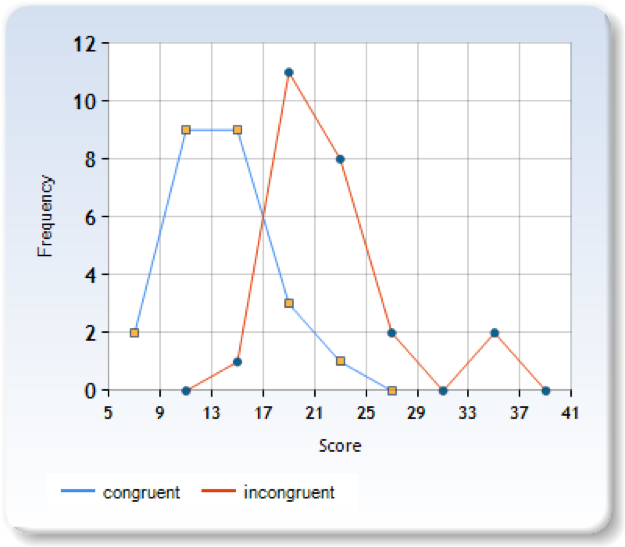

## Overview
In this project, I investigated a classic phenomenon from experimental psychology called the Stroop Effect. (In psychology, the Stroop effect is a demonstration of interference in the reaction time of a task.) I first learned about about the idea of the experiment and creating a hypothesis regarding the outcome of the task.Then I looked at data collected from others who have performed the task and I computed the key statistics describing the results. Finally, I was able to interpret my results in terms of the hypotheses.   

If you are interested in it, please find **`Statistics Project-Test Stroop Effect.pdf`** for more detailed documentation!

## Skills Used   
 Skills | Tasks
 --- | ---
RESEARCH METHODS| Find the most suitable statistic test among the many candidates
VISUALIZING DATA|Create and interpret histograms, bar charts, and frequency plots
CENTRAL TENDENCY|Compute and interpret the 3 measures of center for distributions: the mean, median, and mode
 VARIABILITY|Quantify the spread of data using the range and standard deviation; Identify outliers in data sets using the interquartile range
STANDARDIZING|Convert distributions into the standard normal distribution using the Z-score; Compute proportions using standardized distributions
NORMAL DISTRIBUTION|Use normal distributions to compute probabilities; Use the Z-table to look up the proportions of observations above, below, or in between values
SAMPLING DISTRIBUTIONS|Apply the concepts of probability and normalization to sample data sets
ESTIMATION|Estimate population parameters from sample statistics using confidence intervals
HYPOTHESIS TESTING|Use critical values to make decisions on whether or not a treatment has changed the value of a population parameter
HYPOTHESIS TESTING|Use critical values to make decisions on whether or not a treatment has changed the value of a population parameter
T-TESTS|Test the effect of a treatment or compare the difference in means for two groups when we have small sample sizes

## References
An [online histogram maker](http://www.socscistatistics.com/descriptive/polygon/Default.aspx) for visualizationI   

An [online histogram maker](http://www.shodor.org/interactivate/activities/Histogram/) for viusalization II

# Statistics Project: Test Stroop Effect

**1. a. What is our independent variable? b. What is our dependent
variable?**

**1.a**. independent variable: whether the word color is congruent with
the word

**1.b.** dependent variable: the time it takes to name the ink colors in
equally sized lists

**2. a. What is an appropriate set of hypotheses for this task? b. What
kind of statistical test do you expect to perform? Justify your
choices.**

**2.a.** An appropriate null hypothesis should be: incongruent words (in
which the meaning of the words is inconsistent with ink color) have no
negative effects or even positive effects on response time of
participants. Or **mathematically expressed**, **H0:
u(congruent)-u(incongruent)&gt;=0**

Corresponding alternative hypothesis should be: incongruent words do
have negative effect on response time of participants. Or
**mathematically expressed, H1: u(congruent)-u(incongruent)&lt;0**

**2.b.** A single-tail t test should be performed since: 1. sample size
is small (only 25); 2.the standard deviation of population of interest,
which is human beings with cognitive ability, is unknown.

The t test is paired since: 1. Data are collected from subjects just on
2 time points (dependent samples);2. Sample size is the same. (Assuming
equal sample variance)

**3.Report some descriptive statistics regarding this dataset. Include
at least one measure of central tendency and at least one measure of
variability.**

Central Tendency measure: The sample mean for each congruent and
incongruent group is 14.051125 and 22.01591667 respectively.

Variability measure: The corresponding SD is 3.559357958 and
4.797057122.

**4.Provide one or two visualizations that show the distribution of the
sample data. Write one or two sentences noting what you observe about
the plot or plots.**

Visualization I

Histograms of two data sets: for congruent group, the distribution is
much more uniform, indicating SD is bigger and the mode is almost the
mean which is 14; for the incongruent group, the distribution is much
narrowed and right shifted comparing with the other.

Visualization II

Polygon line chart: again, it confirms the central tendency measures
right shift dramatically in the second group.

**5. Now, perform the statistical test and report your results. a. What
is your confidence level and your critical statistic value? b. Do you
reject the null hypothesis or fail to reject it? c. Come to a conclusion
in terms of the experiment task. Did the results match up with your
expectations?**

**5.a.** Choose 95% as confidence level, the calculated confidence
interval is -7.9648(Mean.a—Mean.b)+/- 2.0556 (i.e., -10.3546 ~ -5.575).
The critical statistic value t(0.05,23) is -1.7138

**5.b.** The critical value t(0.05,23) is -1.7138, while the computed
t(0.05,23) =-8.02, thus null hypothesis is rejected.

**5.c.** So the conclusion is: there is indeed significant difference in
response time between congruent word group and incongruent word group.
It is not surprising to see this conclusion. First, when I did Stroop
test myself I found strong disruption from incongruence. And the 2
visualizations experiment lends credit to the observation further.

**6. Optional: a. What do you think is responsible for the effects
observed? b. Can you think of an alternative or similar task that would
result in a similar effect? Some research about the problem will be
helpful for thinking about these two questions!**

**6.a.** There are couple of theories trying to explain the interesting
effect. I favor Speed of Processing Theory, in which it is claimed the
interference occurs because words are read faster than colors are named.

**6.b.** There is a popular game in entertainment TV programmes, which
takes advantage of similar effect: once after the emcee gives the
command, such as 'lie down’, 'turn right' ,'Walk right', in response the
players should do 'stand up' , 'turn left', 'walk left' immediately,
which is exact opposite to command.
